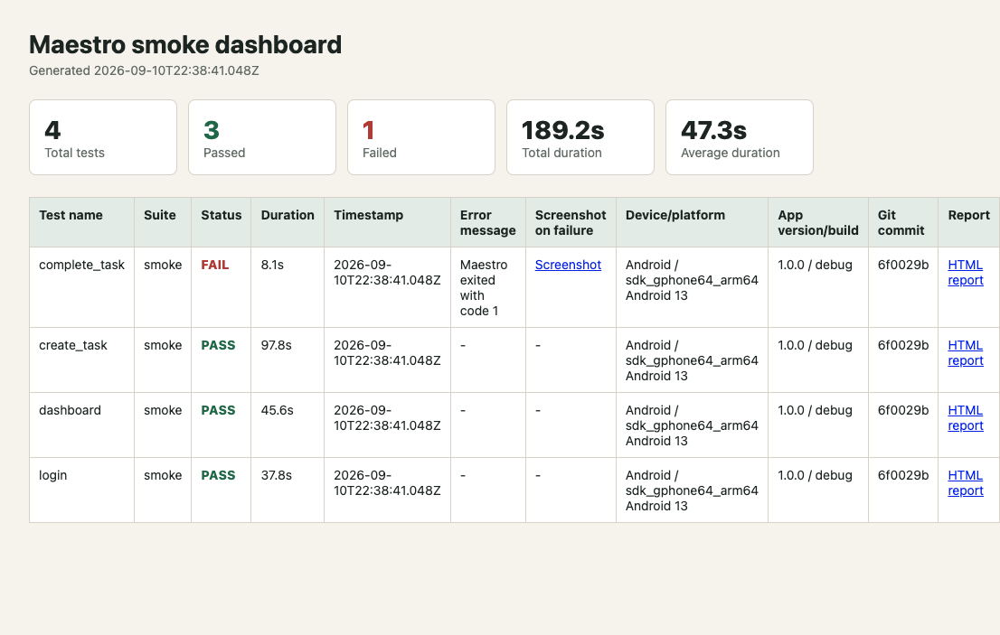
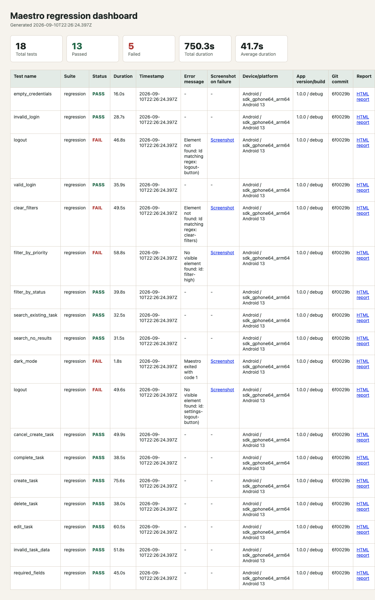

# QA Task Manager

A small React Native + TypeScript app built to demonstrate reliable mobile QA automation with Maestro. It uses deterministic local mock data and a local demo login, so no backend or credentials are required.

## Features

- Demo login validation
- Dashboard task metrics, search, and status filters
- Add, edit, complete, and delete QA tasks
- Task details with priority, status, and due date
- Settings with user information and a dark mode toggle
- Stable `testID` and accessibility identifiers on interactive controls

## Demo account

- Email: `qa@example.com`
- Password: `Password123`

## Local setup

```bash
npm install
npm start
```

Then press `a` for an Android emulator or `i` for an iOS simulator. You can also run `npm run android` or `npm run ios` directly.

## Maestro flows

The flows live in `.maestro/` and assume the app is already running on the selected emulator or simulator. The suite is split into quick smoke coverage and broader regression coverage.

The automation suite is designed to:

- Validate critical user journeys
- Detect functional regressions quickly
- Validate positive and negative scenarios
- Support Android and iOS testing
- Minimize test flakiness
- Provide clear and actionable test results
- Run automated tests locally and in CI/CD
- Keep tests easy to understand and maintain

## Why Maestro Was Selected

Maestro was selected because it provides a simple and reliable approach to mobile UI and end-to-end testing without requiring a large programming framework.

### Key reasons

**Simple test syntax**

Tests are written in YAML, making them easy for QA engineers to read and maintain:

```yaml
- launchApp

- tapOn:
	id: "login-email"

- inputText: "qa@example.com"

- tapOn:
	id: "login-button"

- assertVisible:
	id: "dashboard-screen"
```

This keeps test scenarios focused on user behavior rather than implementation details.

**Cross-platform support**

The same automation approach can be used for Android and iOS, reducing duplicated test logic.

**Fast feedback**

Maestro can execute targeted smoke tests quickly, making it suitable for CI pipelines and release validation.

**Stable synchronization**

Maestro automatically waits for UI elements to become available in many situations, reducing the need for arbitrary waits.

**Low maintenance**

The framework does not require a large amount of application-specific automation code.

## Definition of Automation Success

The automation strategy is considered successful when it provides:

- Reliable execution
- Fast feedback
- Meaningful functional coverage
- Maintainable test flows
- Clear failure information
- Repeatable test data
- Cross-platform coverage
- CI/CD integration

## Smoke vs Regression

### Smoke Tests

Smoke tests validate the most important application workflows. They provide fast feedback that the core app experience is working, including login, dashboard access, task creation, and task completion.

Smoke flows are located in `.maestro/smoke/` and use the `smoke` tag.

### Regression Tests

Regression tests provide broader functional coverage. They cover authentication edge cases, task management, search, filters, validation, settings, and logout behavior.

Regression flows are located in `.maestro/regression/` and use the `regression` tag.

## Selector Strategy

Stable selectors are a key part of the automation strategy. The application uses dedicated accessibility identifiers and test IDs for interactive elements.

Examples:
login-email
login-password
login-button
dashboard-screen
add-task-button
task-title
task-status
task-priority
edit-task-button
delete-task-button
complete-task-button
logout-button


### Selector priority

The preferred selector strategy is:

1. Stable test ID or accessibility identifier
2. Accessibility label
3. Unique visible text
4. Relational selector when elements are not unique, using `above`, `below`, `rightOf`, or `leftOf`
5. Coordinate-based interaction only as a last resort

Preferred:

```yaml
- tapOn:
	id: "login-button"
```

When elements are not unique, prefer a relational selector before using coordinates:

```yaml
- tapOn:
	text: "Delete"
	below: "Edit"

- tapOn:
	text: "High"
	rightOf: "Medium"

- tapOn:
	text: "Due date"
	above: "Save task"

- tapOn:
	text: "Cancel"
	leftOf: "Save task"
```

Avoid coordinate-based interaction when a stable selector is available:

```yaml
- tapOn:
	point: "50%,80%"
```

Coordinates are sensitive to screen size, device resolution, orientation, UI changes, and font scaling. Stable identifiers provide better reliability and keep tests less dependent on the visual implementation.

```bash
./scripts/run-maestro.sh smoke
./scripts/run-maestro.sh regression

# Generate HTML, metrics, and GitHub summary reports. Test data is loaded automatically:
npm run test:smoke
npm run test:regression
```

The lightweight Maestro POM lives in `.maestro/screens/` and `.maestro/flows/`. Screen files contain reusable screen assertions and stable IDs; flow files contain reusable actions and compose the screen files. Smoke and regression tests consume those flows instead of duplicating navigation. `scripts/run-maestro.sh` runs flows one at a time because local Maestro flows share one emulator. Stable demo values are documented in `.maestro/test-data/`.
Flows read test data with Maestro expressions such as `${QA_EMAIL}` and `${TASK_TITLE}`. The report runner loads `.maestro/test-data/*.yaml` automatically and passes the values to Maestro. Variables can still be overridden, for example: `QA_EMAIL=other@example.com npm run test:smoke`.

The app deliberately avoids network calls, long animations, random data, and coordinate-based interactions so the flows remain repeatable.

Each report run writes to `reports/<suite>/`:

- `index.html` - metrics dashboard with pass rate, durations, device, app build, commit, errors, and failure screenshots
- `<test-name>.html` - Maestro `HTML-DETAILED` report for each flow
- `github-summary.md` - GitHub Actions job summary table
- `results.json` - machine-readable test metrics

### Open reports locally

After running a suite, open its metrics dashboard in your browser:

```bash
open reports/smoke/index.html
open reports/regression/index.html
```

You can also open an individual detailed report or the GitHub summary:

```bash
open reports/smoke/login.html
open reports/smoke/github-summary.md
```

On Linux, use `xdg-open` instead of `open`. On Windows, use `start`.

The GitHub workflow at `.github/workflows/maestro.yml` runs smoke and regression suites on an Android emulator, uploads the report directories as artifacts, and publishes the summary to the Actions run. Failure screenshots are captured with ADB and linked from the dashboard.

CI retries each smoke or regression suite up to three total attempts to reduce failures caused by transient emulator or device conditions. The workflow still fails after the third unsuccessful attempt.

## Test evidence

Smoke report dashboard:



Regression report dashboard:



Smoke test execution recording:

<video src="docs/media/smoke-run.mp4" controls width="720"></video>

[Open the smoke test recording](docs/media/smoke-run.mp4)

## Project structure

```text
.
├── App.tsx                         # React Native app and local task state
├── app.json                        # Expo app metadata and native IDs
├── package.json                    # Expo, React Native, and test scripts
├── scripts/
│   ├── run-maestro.sh              # Short local smoke/regression command
│   └── run-maestro-report.mjs      # Test runner and report generator
├── .github/
│   └── workflows/
│       └── maestro.yml             # Android CI workflow and report artifacts
├── .maestro/
│   ├── config.yaml                 # Shared Maestro app configuration
│   ├── screens/                    # Lightweight screen objects/assertions
│   ├── flows/                      # Reusable login, task, logout, and reset flows
│   ├── smoke/                      # Fast tagged smoke scenarios
│   ├── regression/                 # Authentication, task, search, filter, and settings tests
│   └── test-data/                  # YAML values consumed by the report runner
├── docs/
│   └── media/                      # README report screenshots and smoke recording
├── assets/                         # Expo app icons and splash assets
└── README.md                       # Setup, test, reporting, and portfolio documentation
```

Generated reports are written to `reports/<suite>/` and are intentionally excluded from Git. Each report directory contains the HTML dashboard, per-test HTML reports, GitHub summary, JSON metrics, logs, and failure screenshots when applicable.

